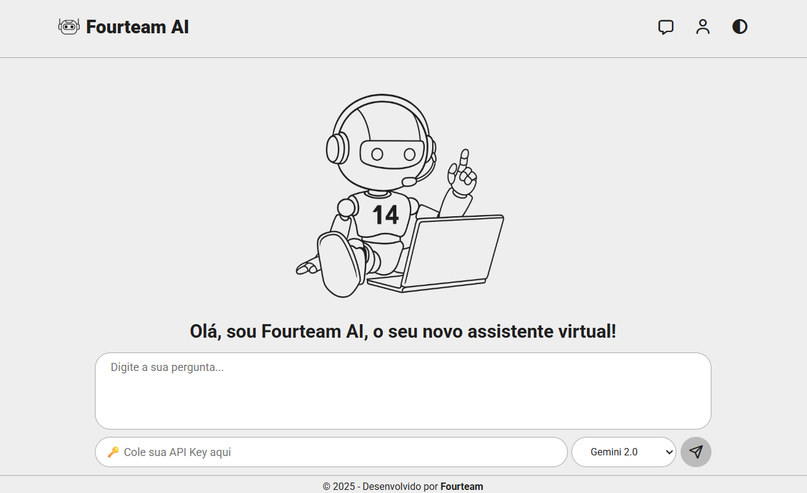
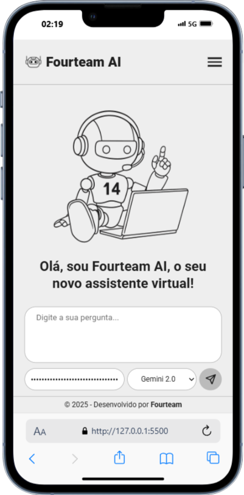

# Visão geral do projeto

Desenvolver um Assistente de IA Web completo usando HTML, CSS e JavaScript puro (sem frameworks).

### Conceito da Aplicação:

1. Usuário digita uma pergunta
2. Clica em "Perguntar"
3. App faz requisição para API da OpenAI
4. Exibe a resposta da IA

## 🎯 Objetivos Gerais

- [x] Criar uma aplicação web interativa do zero
- [x] Integrar com APIs externas (OpenAI/Gemini)
- [x] Implementar validação de formulários
- [x] Gerenciar estados de loading e erro
- [x] Usar APIs do navegador (localStorage, clipboard)
- [x] Criar interfaces responsivas e acessíveis
- [x] Aplicar boas práticas de UX/UI
- [x] Botão de "limpar", com confirmação e msg de sucesso
- [x] Botão de "Copiar", com feedback
- [x] Melhorias na interface
- [x] Responsividade melhorar
- [ ] Histórico de conversas
- [x] Temas - Dark/Light
- [ ] Múltiplos provedores
- [x] Markdown rendering - Resposta formatadas
- [x] Export (salvar e pdf)

## 🧱 Estrutura do Projeto

```
assistente-ia/
├── src/
│   ├── css/
│   │   ├── responsive.css   # ajustes responsivos
│   │   ├── style.css        # estilos principais
│   │   └── theme.css        # temas (dark/light)
│   ├── images/              # imagens do projeto
│   └── js/
│       ├── script.js        # script principal
│       └── style.js         # scripts de interface (toggle tema e menu hamburger)
├── index.html
└── README.md

```

# ⚒️ Projeto

🎥 [Demonstração](https://www.youtube.com/watch?v=F374Uh_66IE)

 

Deploy: [https://henrykhsa.github.io/Fourteam-Projeto-6/](https://henrykhsa.github.io/Fourteam-Projeto-6/)

# 💻 Configuração e Uso

### Pré-requisitos

- Navegador moderno (Chrome, Firefox, Safari, Edge)
- Chave de API da OpenAI
- Editor de código (VS Code recomendado)
- Conhecimentos básicos em HTML, CSS e JavaScript

### Fluxo da Aplicação

1. Usuário obtém uma API Key da OpenAI
2. Usuário abre a aplicação no navegador
3. Usuário insere sua API Key no campo apropriado
4. Usuário digita sua pergunta no textarea
5. Usuário clica em "Perguntar" ou usa Ctrl+Enter
6. Aplicação exibe a resposta da IA
7. Usuário pode copiar a resposta ou limpar para nova pergunta

## Como Obter uma API Key

### OpenAI API Key (Modelos Pago)

Para usar a API da OpenAI, você precisará criar uma conta e obter uma chave de API:

1. Acesse: https://platform.openai.com/
2. Crie uma conta ou faça login
3. Vá para API Keys: No painel, procure por "API Keys" no menu
4. Gere nova chave: Clique em "Create new secret key"
5. Copie e guarde a chave em local seguro (não será mostrada novamente)

**_Importante: A OpenAI oferece créditos gratuitos limitados para novos usuários. Consulte os preços e limites no site oficial._**

### Google Gemini API Key (Alternativa Gratuita)

Uma excelente alternativa gratuita é usar o Google Gemini:

Passo a Passo para Gemini:

1. Acesse o Google AI Studio

- Vá para: https://aistudio.google.com/
- Faça login com sua conta Google

2. Gere sua API Key

- Clique em "Get API Key" ou "Obter chave da API"
- Selecione "Create API Key"
- Copie e guarde sua chave em local seguro

3. Limites do Plano Gratuito

- O Gemini oferece uso gratuito generoso para desenvolvimento
- Consulte os limites atuais na documentação oficial
- Ideal para aprender e testar aplicações
- NÃO ADICIONE DADOS DE PAGAMENTO para conseguir obter os limites gratuitos.
